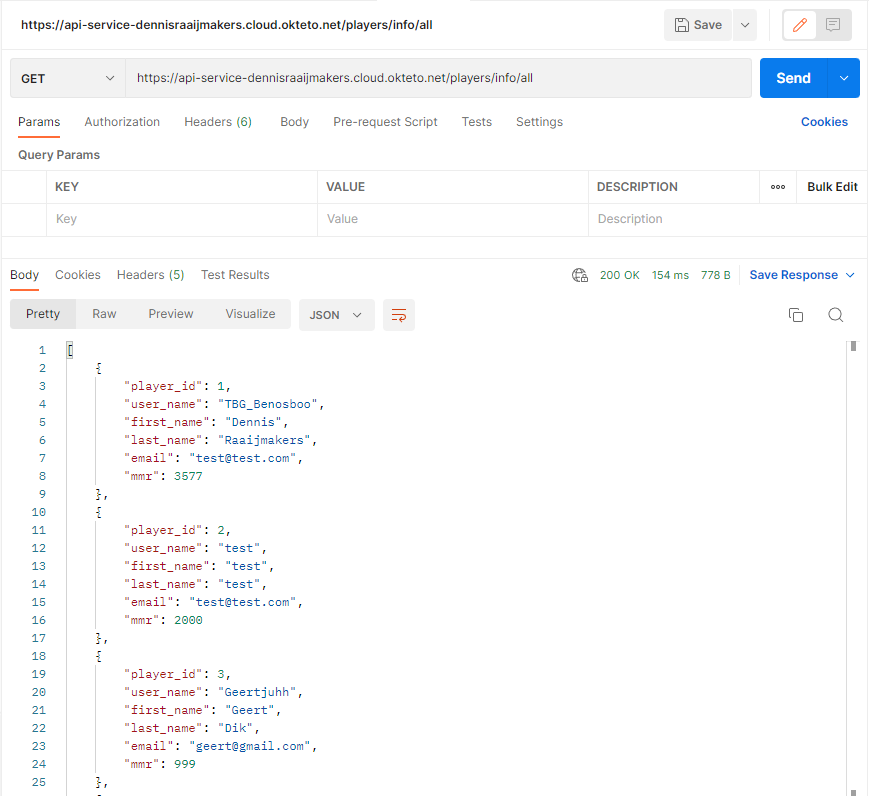

# Project API
## Dennis Raaijmakers (r0894881)
## Klas: 2CCS01

## Beschrijving van het gekozen onderwerp
### Het onderwerp van mijn API is een video spel genaamd Rainbow Six Siege. In mijn API kan je informatie van een speler opvragen of een nieuwe speler maken en informatie van een opperator opvragen.  

## Post request player
Bij de post request kan je een speler aanmaken. Je moet 5 waardes meegeven: de username, voornaam, achternaam, email en mmr. Dit moet je ingeven in een JSON formaat.
Voorbeeld van een body in JSON:
<pre>
{
    user_mame: "Player1",
    first_name: "Dennis",
    last_name: "Raaijmakers",
    email: "test@gmail.com"
    mmr: 3577
}
</pre>
Als je bij de user_name, first_name en last_name niks ingeeft dan wordt er invalid terug gegeven. Als je bij mmr geen cijfer meegeeft dan wordt het automatisch aangevuld naar een 0.
## Get request player
De informatie die je krijgt als je de speler opzoekt zijn: de username, voornaam, achternaam, email en mmr van de speler. 
Als je een lijst wilt met alle spelers kan je `/player/info/all` toe te voegen aan de url.

De url die je gebruik om een specifieke speler te zoeken is `/player/info/specific/{userName}` (met userName als een naam). Hier wordt gebruik gemaakt van een **path parameter**.

## Get request opperator
De informatie die je krijgt van een opperator zijn: opp_id, opperatorName, primaryWeapon en secondaryWeapon.
Als je in de url `/opperator/info/all` ingeeft dan krijg je de informatie van alle opperators.

Als je in de url `/opperator/info/specific/{opp_id}` (met opp_id als een nummer) dan krijg je een specifieke opperater die het id heeft die in de url meegegeven wordt. Hier wordt gebruik gemaakt van een **path parameter**.

Als je in de url `/opperator/info/query/random?amount=2` (de nummer 2 kan je aanpassen) krijg je in dit geval 2 random opperators te zien met hun opp_id, opperatorName, primaryWeapon en secondaryWeapon. Hier wordt er gebruik gemaakt van een **query parameter**.  

## Uitbreiding
Ik heb de website gestyled zodat de website er iets beter uitziet.
Ook heb ik gewerkt met een database ik heb ik sqlalchemy gebruikt. 

## Links API:
### Link naar hosted API:
### Link naar front end: https://github.com/DennisRaaijmakers/dennisraaijmakers.github.io
### Link naar hosted front end: https://dennisraaijmakers.github.io/

## Screenshot van werkende API
Hier zie je een screenshot van alle get en post requests:
  

Hier kan je zien dat ik een speler aangemaakt heb via de website. Eerst klik je op submit om een player aan te maken vervolgens druk je op de knop show players en dan worden alle spelers getoont, ook de speler die je zelf hebt aangemaakt.
  

Via postman kan je ook get en post requests uitvoeren.  
Je kan alle operators opvragen, die worden dan getoont met hun uitrusting.  
Url: `https://api-service-dennisraaijmakers.cloud.okteto.net/opperators/info/all`
  

Je kan ook een specifieke operator opvragen. Dit doe je door de operator id in te geven.  
Url: `https://api-service-dennisraaijmakers.cloud.okteto.net/opperators/info/specific/{opp_id}`
  

Als query parameter heb ik gekozen om verschillende opperators random te tonen. Er kunnen geef dubbele komen want als je een getal mee geeft dat groter of gelijk is aan het aantal operators dan worden ze allemaal gegeven. Ook kan je niet hoger gaan als 60.   
Url: `https://api-service-dennisraaijmakers.cloud.okteto.net/opperators/info/query/random?amount=2`
  

Voor players heb ik ook een get request gemaakt die alle spelers met bijkomende info laat zien. 
Url: `https://api-service-dennisraaijmakers.cloud.okteto.net/players/info/all`
  

Je kan ook een specifieke speler opvragen door de voornaam van de speler in te geven.  
Url: `https://api-service-dennisraaijmakers.cloud.okteto.net/players/info/specific/Dennis`
  

Via postman kan je ook een post request uitvoeren.  
Url: `https://api-service-dennisraaijmakers.cloud.okteto.net/players/create`
  

Als je vervolgens een nieuwe specifieke request doet voor de speler dan kan je zien dat deze is toegevoegd.
Url: `https://api-service-dennisraaijmakers.cloud.okteto.net/players/info/specific/post`
  

Je kan ook nog op de website checken of de speler toegevoegd is door weer op de knop show players te drukken.
  

## Bronnenlijst: 
https://technotrampoline.com/articles/building-an-ajax-form-with-alpinejs/  
https://pages.github.com/  
https://www.youtube.com/watch?v=0RqfzBRDWtk  
https://www.youtube.com/watch?v=NuDSWGOcvtg  
https://docs.github.com/en/get-started/writing-on-github/getting-started-with-writing-and-formatting-on-github/basic-writing-and-formatting-syntax  